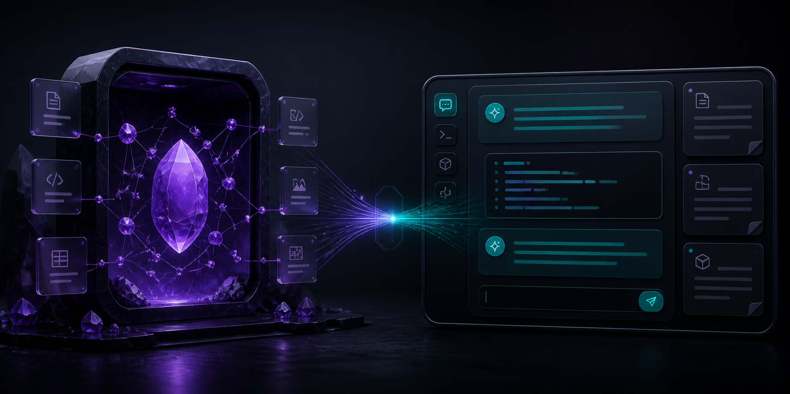

<p align="center"></p>

<h1 align="center">Codex Workspace</h1>
<p align="center">기존 Codex CLI 세션을 Obsidian 안으로 — API 키나 내장 웹페이지가 필요 없습니다.</p>
<p align="center"><a href="README.md">English</a> · <a href="README.zh-TW.md">繁體中文</a> · <a href="README.zh-CN.md">简体中文</a> · <a href="README.ja.md">日本語</a> · <strong>한국어</strong></p>

> [!IMPORTANT]
> Codex Workspace는 독립 커뮤니티 프로젝트이며 Obsidian 또는 OpenAI의 공식 제품이나 제휴 제품이 아닙니다.

## 대화할 수 있는 Vault

Obsidian 왼쪽 Ribbon의 Codex 아이콘을 누르면 오른쪽 사이드바에 지속형 대화 패널이 열립니다.
이미 설치하고 로그인한 Codex CLI를 사용하며 현재 Vault를 작업 디렉터리로 실행합니다.

회의 노트 정리, Markdown 문서 간 연결, 연구 폴더 요약, frontmatter와 Wiki 링크 정리,
문제 해결 협업, 기존 Codex skills／plugins／MCP 활용을 요청할 수 있습니다.

## 주요 기능

| 기능 | 설명 |
| --- | --- |
| 기존 Codex 로그인 | 로컬 Codex CLI／ChatGPT 로그인을 사용하며 API 키를 요청하거나 저장하지 않습니다. |
| 네이티브 패널 | 왼쪽 Ribbon에서 Obsidian 오른쪽 `ItemView`를 엽니다. |
| 멀티턴 대화 | `codex exec resume`으로 같은 session을 이어갑니다. |
| Vault 작업 | 현재 로컬 Vault를 작업 디렉터리로 사용합니다. |
| 권한 제어 | 읽기 전용 분석 또는 workspace-write를 선택할 수 있습니다. |
| 로컬 기록 | 메시지와 session ID는 플러그인 데이터에만 저장됩니다. |

## 요구 사항과 설치

- Obsidian Desktop 1.7.2 이상.
- Codex CLI 설치 후 `codex` 로그인이 완료되어야 합니다.
- 현재 macOS／Linux를 지원하며 Windows는 아직 검증되지 않았습니다.

[최신 Release](https://github.com/yamantaka520/Codex-Plugin-for-Obsidian/releases/latest)에서
`manifest.json`, `main.js`, `styles.css`를 다운로드해
`<Vault>/.obsidian/plugins/codex-workspace/`에 넣습니다. Obsidian을 다시 시작하고
**Settings → Community plugins**에서 **Codex Workspace**를 활성화하세요.
[BRAT](https://github.com/TfTHacker/obsidian42-brat)으로 beta를 설치할 수도 있습니다.

## 권한과 개인정보

- **계정:** 전체 기능에는 로그인된 로컬 Codex CLI／ChatGPT 계정이 필요합니다.
- **네트워크:** 플러그인은 Codex CLI를 실행하며 CLI가 설정에 따라 OpenAI 서비스와 통신합니다. 플러그인 자체는 OpenAI API를 호출하지 않습니다.
- **Vault 외부 접근:** Vault 밖의 Codex 실행 파일을 시작합니다. CLI는 자체 설정·인증 디렉터리를 사용하며 플러그인은 인증 정보를 읽거나 복사하지 않습니다.
- **Vault 권한:** 기본값은 현재 Vault로 제한된 `workspace-write`이며 분석 전용으로 `read-only`를 선택할 수 있습니다.
- **승인:** 기본값은 `--approve-for-me`지만 위험한 sandbox bypass는 절대 사용하지 않습니다.
- **로컬 데이터:** 메시지와 session ID는 로컬에 저장되며 클라이언트 텔레메트리나 광고가 없습니다.

중요한 변경 전에는 Git 또는 백업을 사용하세요. 자세한 내용은 [SECURITY.md](SECURITY.md)를 참고하세요.

## 현재 제한과 계획

0.2.0은 초기 public beta입니다. 한 번에 하나의 Codex turn만 실행하며 안전한 progress event 스트리밍을 지원하지만 Windows 검증은
아직 지원되지 않습니다. 다중 대화, 현재 노트 context, 파일 변경 review, GUI 테스트 및
Obsidian Community Directory 자동 심사 대응을 순차적으로 진행할 예정입니다. 자세한 내용은
[다음 단계 실행 계획](docs/NEXT_PHASE.md)을 참고하세요.

## 개발

```bash
npm install
npm run build
npm test
npm audit --omit=dev
```

[CONTRIBUTING.md](CONTRIBUTING.md)를 먼저 확인하세요. 라이선스는 [MIT](LICENSE)입니다.
